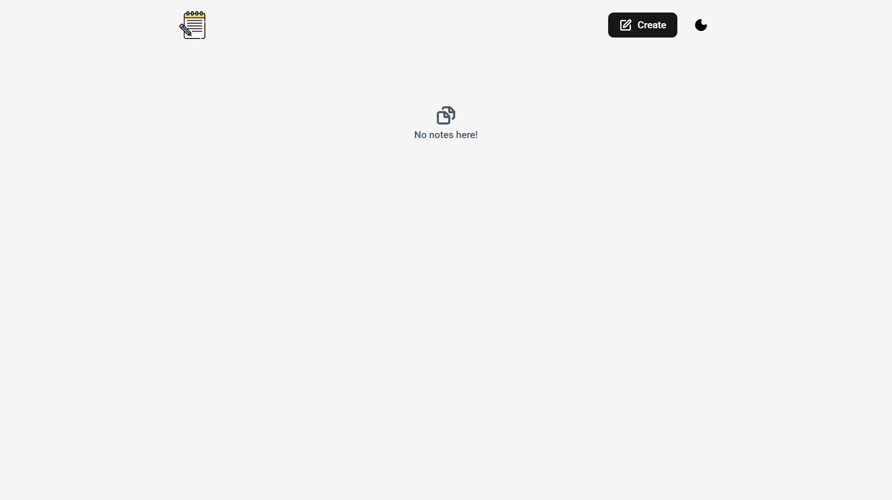

# 📝 Note-Hub Web Application

Notehub is a premium, production-ready, minimalist note-taking web application designed with modern, calming aesthetics. Built using **Solid.js**, **TypeScript**, **Tailwind CSS v4**.

---

## ✨ Features

- 🎨 **Minimalist Design & Premium Aesthetics:** Anchored in a soft `#F8F9FA` background, providing deep slate and indigo interactive visual hierarchy, ambient elevations, and smooth hover micro-animations.
- 🌐 **Robust Internationalization (i18n) & RTL:** Natively supports English (EN, LTR), French (FR, LTR), and Arabic (AR, RTL) with dynamic locale detection and layout mirroring.
- ⚡ **Tailwind CSS v4 & Vite Plugin:** Uses Vite-native `@tailwindcss/vite` compiling in milliseconds for lightweight, production-ready assets.

---

## 🛠️ Tech Stack & Configurations

- **Core Framework:** [Solid.js](https://www.solidjs.com/) with TypeScript
- **Bundler & Dev Server:** [Vite](https://vite.dev/)
- **Routing:** `@solidjs/router`
- **Styling:** [Tailwind CSS v4](https://tailwindcss.com/)
- **Icons & Typography:** Google Roboto Font & Lucide Icons

---

## 🧪 Testing Locally

1. **Rich Text Composition:** Navigate to `/create` (by clicking the "Create Note" button), write some headings, bullet lists, or bold text. Select a Notebook category and click "Save Note."
2. **Dynamic Filtering:** Use the search bar or tags list in the sidebar. Click a tag chip to instantly filter the dashboard view.
3. **Locale Swapping:** Click the language switcher dropdown in the navigation. Set it to French or Arabic. The layout instantly mirrors naturally to Right-To-Left (RTL) for Arabic.
4. **CRUD Integrity & Modal Alerts:** Navigate to `/note/:id` to read your note. Click "Delete Note." A localized warning dialog will prompt you to confirm or cancel the operation.
